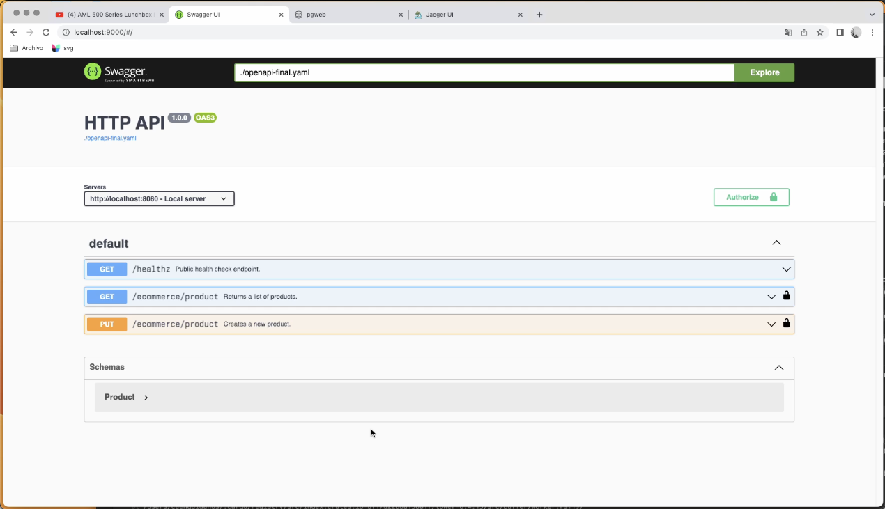
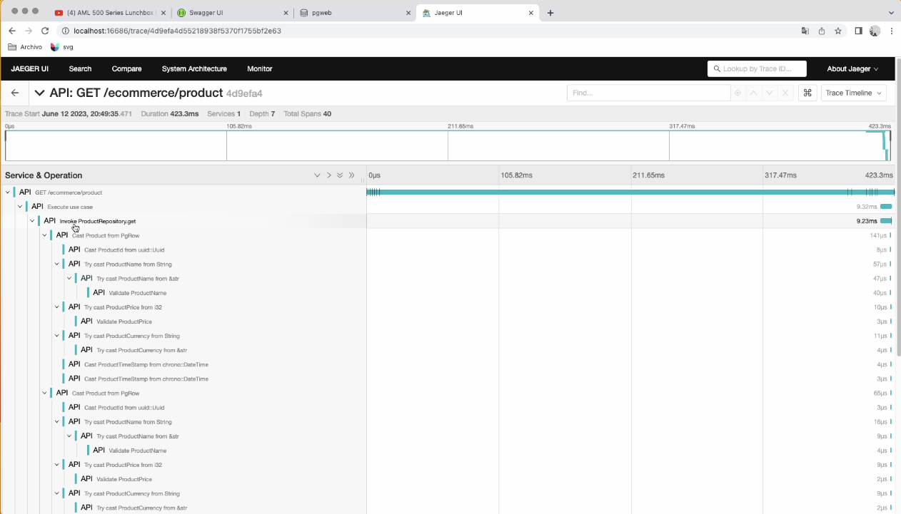
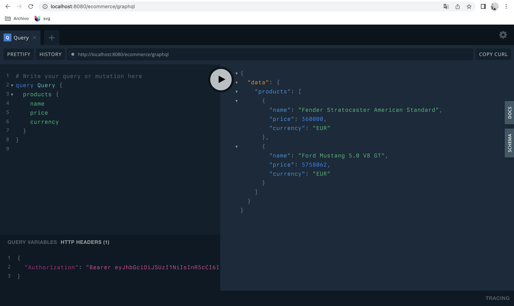
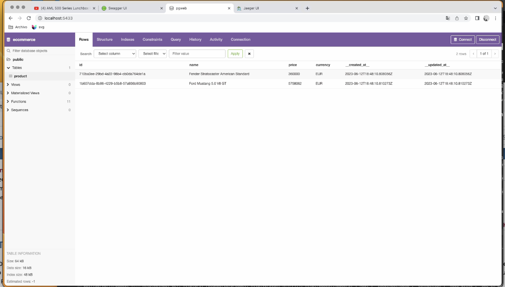
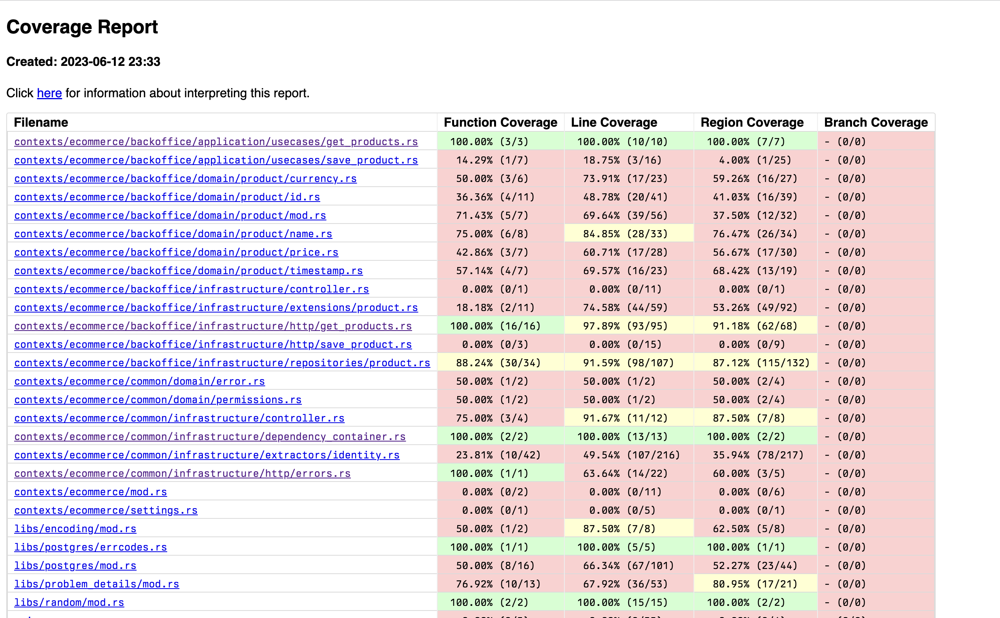
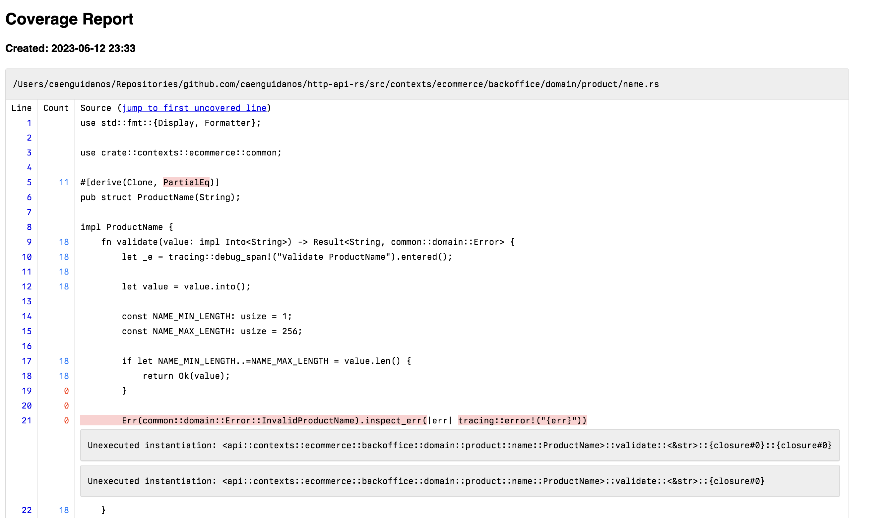

# HTTP API Rust template

Template for production ready HTTP servers in Rust.

[](https://render.com/deploy)

- **HTTP Server**: Axum
- **GraphQL Server**: Async-Graphql
- **Database**: Postgres
- **Identity**: OAuth2 - RBAC
- **Observability**: OpenTelemetry/Jaeger
- **Documentation**: Openapi 3.0 / SwaggerUI
- **CI**: GitHub Actions

### Required dependencies

- [Rust](https://www.rust-lang.org/tools/install)
- [Docker](https://docs.docker.com/engine/install/)

### Environment

Create and fulfill environment files from `config/env/*`. For example:

```shell
cp config/env/.env.example config/env/.env
```

| Environment variable      | Description                                                   | Example                                            | Documentation                                                                 |
|---------------------------|---------------------------------------------------------------|----------------------------------------------------|-------------------------------------------------------------------------------|
| `OAUTH_CLIENT_ID`         | The client_id of the application from your oauth provider     | -                                                  | [Auth0](https://auth0.com/docs/get-started/applications/application-settings) |
| `OAUTH_DOMAIN`            | Your domain from your oauth provider                          | https://auth.example.com                           | [Auth0](https://auth0.com/docs/customize/custom-domains)                      |
| `OAUTH_AUDIENCE`          | Your API identifier as oauth resource                         | https://api.example.com                            | [Auth0](https://auth0.com/docs/get-started/apis/api-settings)                 |
| `OAUTH_AUTHORIZATION_URL` | OAuth Authorization URL of your application with the audience | `OAUTH_DOMAIN`/authorize?audience=`OAUTH_AUDIENCE` | [Auth0](https://auth0.com/docs/get-started/apis/api-settings)                 |
| `OAUTH_TOKEN_URL`         | OAuth Token URL of your application                           | `OAUTH_DOMAIN`/oauth/token                         | [Auth0](https://auth0.com/docs/get-started/apis/api-settings)                 |

### Run

#### Start server

```shell
cargo run --release
```

- Axum HTTP Server will run on: `:8080`
-

#### Start server with Hot Reload

```shell
cargo install cargo-watch

cargo watch -w src -x run
```

#### Start infrastructure

```shell
docker compose up
```

Database **seed** is injected with `tools/scripts/pg_init.sh`.

- Postgres will run on: `:5432`
- Postgres GUI will run on: `:5433`
- Jaeger will run on: `:16686`
- Swagger will run on: `:9000`

### Lint

```shell
cargo clippy -- -D warnings
```

> Run `rustup component add clippy` if **clippy** is not installed yet in your system

### Format

```shell
cargo fmt --all -- --check -v
```

> Run `rustup component add rustfmt` if **clippy** is not installed yet in your system

### Build

```shell
cargo build
```

### Local Test

#### Start infrastructure

```shell
docker compose up
```

#### Execute Rust tests with Postgres Template Database

More info [here](https://www.postgresql.org/docs/current/manage-ag-templatedbs.html).

```shell
export DATABASE_TEMPLATE=ecommerce_template

cargo test

# with coverage
cargo llvm-cov --open
```

> Run `cargo install cargo-llvm-cov` if **cargo-llvm-cov** is not installed yet in your system

### Screenshots

#### Swagger UI



#### Jaeger trace



#### GraphQL



#### Postgres GUI



#### llvm-cov


